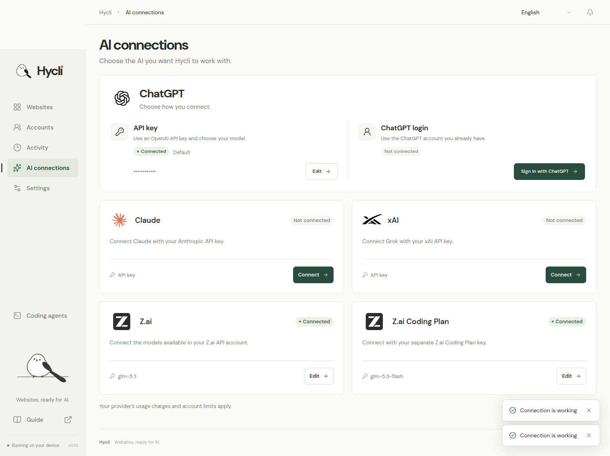
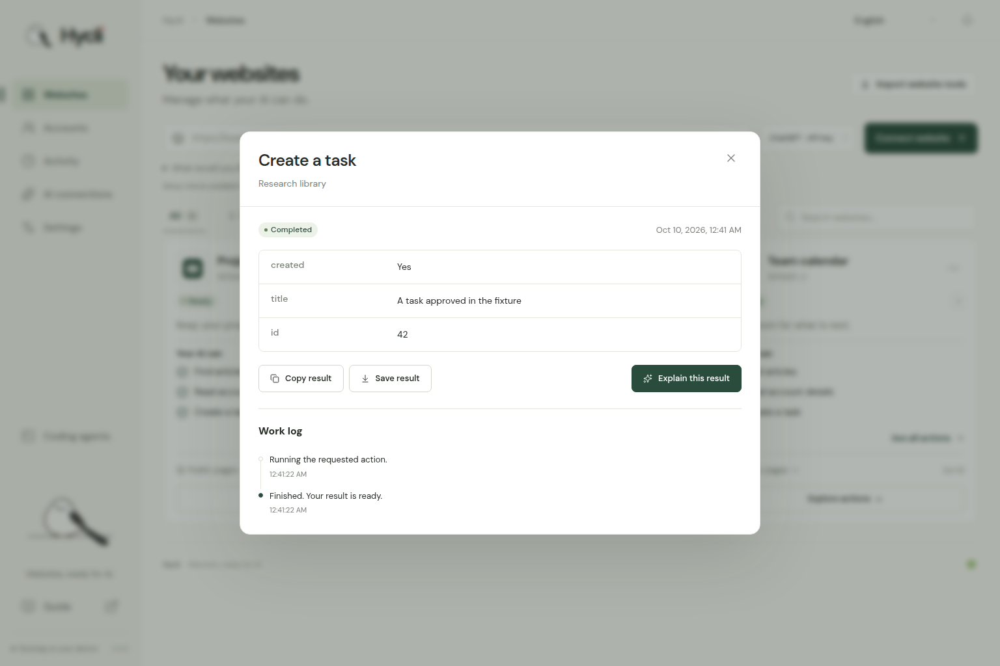

<p align="center">
  
</p>

<p align="center">
  <strong>Turn websites into tools your AI can use.</strong>
</p>

<p align="center">
  <a href="https://github.com/Hybirdss/Hycli/releases/tag/v0.1.0"></a>
  <a href="LICENSE"></a>
  <a href="#use-hycli-with-your-ai"></a>
  <a href="#languages"></a>
</p>

<p align="center">
  <a href="https://github.com/Hybirdss/Hycli/releases/tag/v0.1.0">Download</a> ·
  <a href="#get-started">Get started</a> ·
  <a href="#what-your-ai-can-do">What your AI can do</a> ·
  <a href="#use-hycli-with-your-ai">Use with your AI</a> ·
  <a href="docs/i18n/README.ko.md">한국어</a> ·
  <a href="docs/i18n/README.ja.md">日本語</a>
</p>

<details>
<summary>Read in your language · 20 languages</summary>

[English](README.md) · [한국어](docs/i18n/README.ko.md) · [日本語](docs/i18n/README.ja.md) · [简体中文](docs/i18n/README.zh-CN.md) · [繁體中文](docs/i18n/README.zh-TW.md) · [Español](docs/i18n/README.es.md) · [Français](docs/i18n/README.fr.md) · [Deutsch](docs/i18n/README.de.md) · [Português (Brasil)](docs/i18n/README.pt-BR.md) · [Bahasa Indonesia](docs/i18n/README.id.md) · [Italiano](docs/i18n/README.it.md) · [Nederlands](docs/i18n/README.nl.md) · [Polski](docs/i18n/README.pl.md) · [Türkçe](docs/i18n/README.tr.md) · [Русский](docs/i18n/README.ru.md) · [Українська](docs/i18n/README.uk.md) · [Tiếng Việt](docs/i18n/README.vi.md) · [ไทย](docs/i18n/README.th.md) · [العربية](docs/i18n/README.ar.md) · [हिन्दी](docs/i18n/README.hi.md)

</details>

Give Hycli a website and a task. It learns the available interface, prepares typed CLI and MCP actions, and checks useful reads. Your AI can then use those actions with the same accounts, approvals and results you see in the local dashboard.

| Connect | Prepare | Use |
| --- | --- | --- |
| Add a website, choose your AI and describe what you want to do. | Follow three workers as they inspect, connect and verify. | Use the dashboard, terminal or your connected AI assistant. |

<p align="center">
  
</p>
<p align="center"><sub>Example workspace with sample tools and accounts.</sub></p>

<a id="get-started"></a>
## Get started

Hycli is one native executable with an embedded local dashboard. Rust and Node.js are needed to build it; neither is needed to run a packaged release.

### Download and run

Download the **[Linux x64 package from v0.1.0](https://github.com/Hybirdss/Hycli/releases/tag/v0.1.0)** and its `.sha256` file into the same directory. It requires glibc 2.39 or newer, such as Ubuntu 24.04.

```sh
sha256sum -c hycli-0.1.0-linux-x64.tar.gz.sha256
tar -xzf hycli-0.1.0-linux-x64.tar.gz
cd hycli-0.1.0-linux-x64
./hycli dashboard
```

The release also includes the reviewed source snapshot, per-file manifests and checksums. Linux x64 is the verified native download for this release. For other Linux systems, macOS or Windows, use the build instructions below; native CI results are recorded in [Actions](https://github.com/Hybirdss/Hycli/actions/workflows/verify.yml).

<details>
<summary><strong>Build from source</strong> · Linux, macOS and Windows</summary>

From a source checkout, install the [build prerequisites](docs/BUILD.md) and run:

```sh
node scripts/build.mjs
./dist/hycli dashboard
```

The build produces `dist/hycli` (`dist/hycli.exe` on Windows) and a SHA-256 checksum. Add `--install-dir <directory>` to install it on your PATH. Native archives can be unpacked into any directory; check their `SHA256SUMS` and run the included executable. See [building and packaging](docs/BUILD.md) for platform prerequisites and the [release checklist](docs/RELEASING.md) for reproducible archive checks.

</details>

### Connect your first website

The dashboard opens at `http://127.0.0.1:4318`. Use `hycli dashboard --no-open` to print the address without opening a browser, or `--port 4320` to choose another port. The website engine and dashboard are included in the same executable.

1. Open **AI connections** and connect a provider.
2. Add a website address, choose the AI and optionally describe your task.
3. Review the available actions. Run one in the dashboard or open **Coding agents** to copy the MCP configuration once.

For a signed-in website, connect its account from **Accounts**. A website can have several saved accounts; you choose which one its tools use. When its tools declare an API key or bearer credential, save it under **Explore actions → Website API keys**. The key stays in the local vault and is never sent to AI.

<a id="what-your-ai-can-do"></a>
## What your AI can do

Hycli turns supported website operations into named, typed tools. AI-written descriptions explain what an action accomplishes, what it needs, and what it returns. A task such as “find my saved references” guides preparation toward the required reads, searches and prerequisite resources.

| Website interface | Prepared capability |
| --- | --- |
| REST and OpenAPI | Typed requests grounded in published JSON or YAML schemas and documentation. |
| GraphQL | Parsed query documents and JSON variables, including endpoints with ordinary names. |
| HTML pages | Structured records, text, links and next-page information from observed selectors. |
| JavaScript-rendered pages | Rendered GET reads through a discovered local Chromium engine. |
| JSON and URL-encoded forms | Documented inputs, defaults and account-scoped requests. |

<table>
<tr><td width="50%"></td><td width="50%"></td></tr>
<tr><td align="center">Choose the AI that prepares your websites.</td><td align="center">Review actions and keep the useful result.</td></tr>
</table>

Three independent AI workers handle reads and search, useful workflows, and account evidence. The dashboard shows completed stages, each worker’s status, elapsed time and plain-language work notes. CLI and MCP work appears in the same activity history.

<p align="center">
  
</p>
<p align="center"><sub>Three workers. One very busy little bird.</sub></p>

Preparation follows information actually available from the website: linked documentation, API schemas, published JavaScript, and request shapes observed by the browser companion. It performs bounded reads before installing a replacement. If a request or extraction check fails, the workers receive that evidence and can revise the definition before checking again. An already working definition stays installed during preparation. It does not create test records, edit content, delete objects, guess large lists of endpoints, or fuzz a live server.

| Action | Behavior |
| --- | --- |
| Read or search | Runs autonomously when the operation is supported by evidence and classified as a read. |
| Create, send, edit or delete | Shows the website, account, action and resolved inputs for the user to approve. |
| Unclear effect | Requires review before sending the request. |
| Authentication, challenge or request limit | Pauses the affected requests and lets you reconnect or wait. |

Approval applies to one exact request, expires after five minutes, and can be consumed only once. Changing the inputs, account, saved sign-in or installed tool definition invalidates it. CLI, MCP and dashboard execution use the same boundary. Writes are never retried automatically. If a change is interrupted after authorization, its outcome is marked uncertain so you can check the website before trying again. An open dashboard reconnects automatically after the local server restarts.

Support depends on the website and the access available on your device. Preparation can adapt between documentation, HTTP and browser evidence; it still needs an implementable operation and a meaningful result. Arbitrary browser click sequences, multipart uploads and binary downloads are outside the current contract. The [operation reference](docs/SITESPEC.md) describes supported requests, extraction and limits.

<a id="ai-connections"></a>
## AI connections

| Connection | Sign-in |
| --- | --- |
| ChatGPT · API key | Your OpenAI API key |
| Claude | Your Anthropic API key |
| xAI | Your xAI API key |
| Z.ai | Your Z.ai API key |
| Z.ai Coding Plan | Your Z.ai Coding Plan API key |
| ChatGPT · login | ChatGPT sign-in managed by the installed Codex app-server |

Choose a model in the dashboard, including a model available specifically to your account. Connection checks verify the provider and selected model. API providers bill usage to your provider account.

The Codex connection uses its official app-server protocol. Hycli does not read or copy Codex OAuth tokens. Inference runs in an ephemeral thread with file, shell, browser, application and MCP execution disabled. Website preparation is performed by Hycli's controlled read tools.

<a id="use-hycli-with-your-ai"></a>
## Use Hycli with your AI

**Coding agents → View connection settings** gives you the exact configuration for the current executable and data directory. Connect your AI app once. The general connection lets it prepare a missing website, follow the job and execute new actions without restarting MCP:

```sh
hycli mcp
```

Use `--sites-only` to expose installed actions only, or limit the connection to one website:

```sh
hycli mcp --sites-only --only-site research-library
```

A typical MCP configuration looks like this:

```json
{
  "mcpServers": {
    "hycli": {
      "command": "hycli",
      "args": ["mcp"]
    }
  }
}
```

Use the executable path shown by the dashboard if `hycli` is not on your agent’s PATH. The general MCP server offers preparation, job status, website listings, account metadata and `hycli_run` for executing newly installed actions even before a client refreshes its tool list. It never offers a tool for reading credentials or approving a change on the user's behalf. The `hycli_result` and `hycli_activity` tools remain available in both modes, so your AI can follow work notes, progress and approved results.

```sh
hycli jobs ls
hycli jobs show JOB_ID --watch
hycli browsers --url https://example.com
```

The same workflow is available from the CLI:

```sh
hycli prepare https://your-website.example --intent "Find saved references"
hycli request SITE "Add draft editing and publishing with full post content"
hycli describe
hycli describe SITE ACTION
hycli SITE ACTION --help
hycli run SITE ACTION --arg query="design systems"
```

Replace the sample URL and uppercase IDs with your website and the names returned by `describe`. Direct syntax such as `hycli SITE ACTION --query "design systems"` also works. Required inputs, typed values, defaults and account selection are shared with the dashboard. A failed HTTP response or unexpected login page produces a failed action and a nonzero CLI exit status.

The reusable [Hycli skill](skills/hycli/SKILL.md) and [agent guide](agent/AGENTS.md) teach assistants to discover missing capabilities, resolve resource IDs through related searches, follow existing jobs and recover from observed failures. The `AGENTS.md` and `CLAUDE.md` versions of each guide are kept identical.

A change requested from CLI or MCP creates an approval for the user to review in the dashboard. Keep the returned receipt and follow its result; do not issue a duplicate action while approval is pending.

<a id="browser-sign-in"></a>
## Browser sign-in

Website preparation starts by inspecting the current OS, running and registered browsers, and available profiles. The AI chooses from those capabilities to read documentation, render pages, import a site session, and verify its connection. Browser and profile paths stay on the local machine; a generated website definition does not depend on the developer's installation paths.

Chrome, Chromium, Edge, Brave and Firefox cookies and origin storage can be imported when accessible. Only the requested website's session enters Hycli’s local vault. Hycli selects a single verified identity automatically; profiles belonging to the same identity count as one account choice. An existing account selection is preserved; different verified identities require a choice.

In **Accounts → Connect an account**, **Find my sign-in** repeats that search. If it cannot find a usable session, **Open website sign-in** opens the website in your default browser. Hycli rechecks while the dialog is open and resumes preparation only after the selected account is verified. Opening a tab alone is never reported as a successful login.

OS-protected, browser-bound, private or container sessions may need the companion. Choose the companion tab, create a connection code, then open the companion in the signed-in profile, enter the code, and grant access to that website. Native import does not bypass Windows App-Bound protection or weaken a browser profile.

- **Chrome and Edge:** unzip the package and use **Load unpacked** on the browser's extensions page.
- **Firefox:** use the Firefox package and **Load Temporary Add-on** in `about:debugging`. Temporary extensions are removed when Firefox restarts. Signed store distribution is not included in this release.
- **Cookie file:** JSON and Netscape cookie-file imports are available as a fallback. Import the file directly in the dashboard; do not paste its contents into an AI conversation.

The browser transfers session data directly to the local credential vault. Models receive account labels, local key names and structure, and tool results with credential values removed. They can construct a connection recipe that references those local values without receiving them. Cookie scope, paths, expiry and supported partition information are respected, and authentication headers remain restricted to their original origin.

Account identity comes from an actual current-account response from the website. A browser profile name is not treated as a verified website identity. If the account has not been identified yet, Hycli says so. After connecting, normal browsing can provide an account response and the shapes of available requests without exposing request values, headers or response bodies to the preparation model.

A site may require a separate documented API credential or a browser capability that is unavailable locally. Preparation records the actual connection and read results. A homepage fetch or a login page returned from an API does not make an integration ready. The [browser setup guide](browser-companion/guide.html) explains the companion flow and limitations.

<a id="languages"></a>
## Languages

The dashboard supports the 20 languages linked above, including right-to-left Arabic. English is the initial language. Your choice is saved on this device, and AI descriptions can be prepared in the selected language.

<a id="local-data"></a>
## Local data and request limits

Website definitions, account metadata and activity stay in the local data directory. Set `HYCLI_DATA_DIR` to choose a different location. Use **Settings** to see the active location and credential protection.

The credential vault uses an OS keyring-backed encryption key when available. When a keyring is unavailable, it explicitly reports a file-permissions-only store; private directories and credential files are restricted to the current OS user. An existing encrypted vault is not silently replaced when it cannot be unlocked.

Requests are serialized and paced per website and account, with an additional website-wide budget. Hycli respects `Retry-After`, bounds response sizes and read retries, and pauses on authentication failures or site challenges. Website preparation does not rotate accounts, spoof fingerprints or bypass challenges to evade a restriction. These measures reduce avoidable pressure; they cannot guarantee that a website will never restrict an account.

Private and local website addresses are disabled by default. For a trusted self-hosted site, launch the dashboard or MCP server with `--allow-local` explicitly.

<a id="contributing"></a>
## Development and verification

Start with [CONTRIBUTING.md](CONTRIBUTING.md) for the project map, local setup and pull request expectations. Read the [changelog](CHANGELOG.md) for the current release and use the [issue forms](https://github.com/Hybirdss/Hycli/issues/new/choose) for reproducible problems or feature requests.

```sh
npm --prefix dashboard ci
npm --prefix dashboard run check
npm --prefix dashboard run build
cargo test --all-targets --locked
cargo build --locked --bin hycli --example dashboard_fixture
node scripts/test-e2e.mjs --full
```

Tests use synthetic local websites and provider responses. They cover approval binding and replay prevention, secret redaction, redirects, rate limits, no write retries, browser-session protection and provider response contracts. Never use a real account to create, modify or delete content merely to test Hycli.

The screenshots show the running Rust dashboard with illustrative website tools and accounts. The preparation animation uses isolated local website and AI-provider fixtures. No personal sign-in data is shown. Public source and native archives use explicit file lists and ship no installed website definitions or account data. The bird is inspired by the shima-enaga, the white long-tailed tit of Hokkaido.

## License and intended use

Hycli is licensed under [Apache-2.0](LICENSE).

Hycli is intended for creating and using command-line tools that make websites easier to use. Use it with websites and accounts you are authorized to access.

The software is provided as is, without warranty. To the extent permitted by law, its authors and contributors are not liable for losses or other problems arising from its use. You are responsible for how you use it.

To the extent permitted by law, the authors and contributors are not liable for account bans, suspensions, or restrictions resulting from the use of Hycli. Do not use Hycli for hacking, unauthorized access, or attacks.
