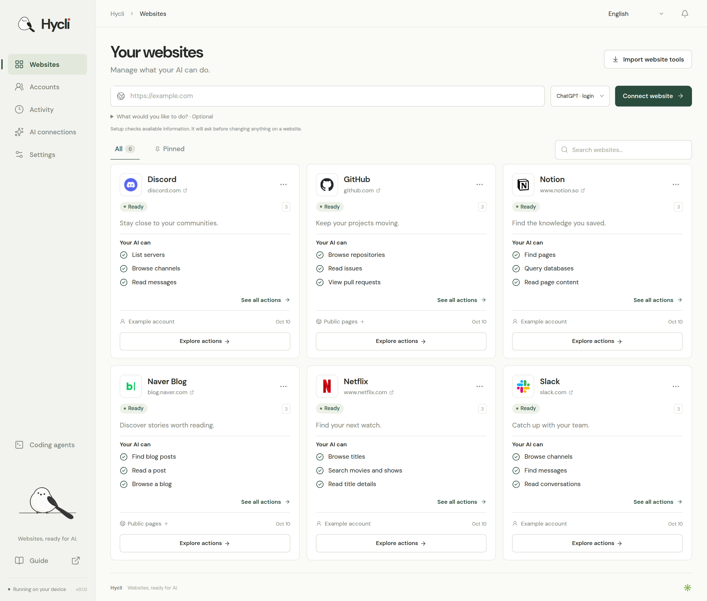
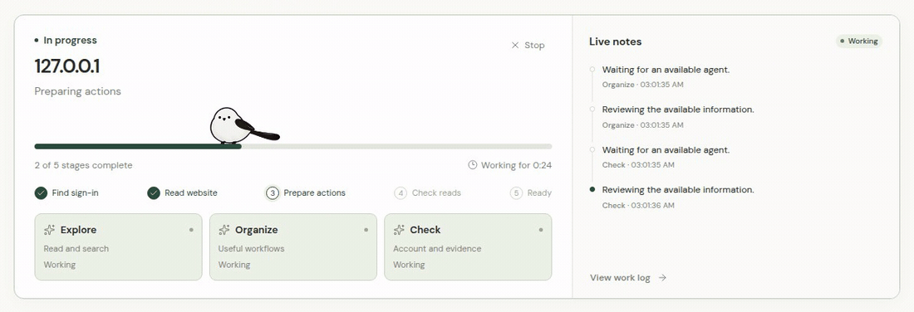

<p align="center">
  
</p>

<p align="center">
  <strong>Transforme sites em ferramentas que sua IA pode usar.</strong>
</p>

<p align="center">
  <a href="#get-started">Primeiros passos</a> ·
  <a href="#what-your-ai-can-do">O que sua IA pode fazer</a> ·
  <a href="#ai-connections">Conexões de IA</a> ·
  <a href="#use-hycli-with-your-ai">Use com sua IA</a>
</p>

<details>
<summary>Leia no seu idioma · 20 idiomas</summary>

[English](../../README.md) · [한국어](README.ko.md) · [日本語](README.ja.md) · [简体中文](README.zh-CN.md) · [繁體中文](README.zh-TW.md) · [Español](README.es.md) · [Français](README.fr.md) · [Deutsch](README.de.md) · [Português (Brasil)](README.pt-BR.md) · [Bahasa Indonesia](README.id.md) · [Italiano](README.it.md) · [Nederlands](README.nl.md) · [Polski](README.pl.md) · [Türkçe](README.tr.md) · [Русский](README.ru.md) · [Українська](README.uk.md) · [Tiếng Việt](README.vi.md) · [ไทย](README.th.md) · [العربية](README.ar.md) · [हिन्दी](README.hi.md)

</details>

Adicione um site. O Hycli prepara ações que sua IA pode usar e explica o que cada uma faz. Reúna seus sites, acessos e resultados em um painel local.

| Conectar | Preparar | Usar |
| --- | --- | --- |
| Adicione um site e escolha sua IA. | Acompanhe o progresso e veja quais ações estão disponíveis. | Execute uma ação ou disponibilize-a para seu assistente de IA. |

<p align="center">
  
</p>
<p align="center"><sub>Espaço de trabalho de exemplo com ferramentas e contas de demonstração.</sub></p>

<a id="get-started"></a>
Insira um domínio e, se quiser, um objetivo no campo ao lado. A IA primeiro entende o site e escolhe fluxos úteis, depois verifica os pré-requisitos, os dados e os resultados. Etapas ausentes mantêm o site marcado para revisão.

## Primeiros passos

**[Baixar v0.1.0 · Linux x64](https://github.com/Hybirdss/Hycli/releases/tag/v0.1.0)** · glibc ≥ 2.39 · [SHA-256](https://github.com/Hybirdss/Hycli/releases/download/v0.1.0/hycli-0.1.0-linux-x64.tar.gz.sha256)

O Hycli é um aplicativo em Rust com um painel web local. A partir desta cópia do repositório, compile o painel e o executável:

```sh
node scripts/build.mjs
./dist/hycli dashboard
```

O painel abre em `http://127.0.0.1:4318`. Use `hycli dashboard --no-open` para exibir o endereço sem abrir um navegador, ou `--port 4320` para escolher outra porta. O mecanismo de sites e o painel estão incluídos no mesmo executável.

1. Abra **Conexões de IA** e conecte um provedor.
2. Adicione o endereço de um site e escolha a IA que vai prepará-lo.
3. Revise as ações disponíveis. Execute uma no painel ou abra **Agentes de programação** para copiar a configuração MCP uma única vez.

Para um site que exige login, conecte a conta em **Contas**. Um site pode ter várias contas salvas; você escolhe qual delas suas ferramentas usam.

<a id="what-your-ai-can-do"></a>
## O que sua IA pode fazer

O Hycli transforma operações compatíveis de sites em ferramentas nomeadas e tipadas. As descrições escritas pela IA explicam o que cada ação faz, quais informações precisa receber e o que retorna.

Três agentes de IA independentes cuidam das leituras e pesquisas, dos fluxos de trabalho úteis e das informações sobre contas. O painel mostra as etapas concluídas, o status de cada agente, o tempo decorrido e notas de trabalho em linguagem simples. As atividades da CLI e do MCP aparecem no mesmo histórico.

<p align="center">
  
</p>
<p align="center"><sub>Três workers. Um passarinho muito ocupado.</sub></p>

A preparação se baseia nas informações realmente disponíveis no site: documentação vinculada, esquemas de API, JavaScript publicado e estruturas de requisições observadas pela extensão do navegador. Ela pode realizar leituras limitadas para verificar uma operação. Não cria registros de teste, edita conteúdo, exclui objetos, tenta adivinhar grandes listas de endpoints nem faz fuzzing em um servidor ativo.

| Ação | Comportamento |
| --- | --- |
| Ler ou pesquisar | Executa de forma autônoma quando a operação é sustentada por evidências e classificada como leitura. |
| Criar, enviar, editar ou excluir | Mostra o site, a conta, a ação e os valores de entrada resolvidos para aprovação do usuário. |
| Efeito incerto | Exige revisão antes de enviar a requisição. |
| Autenticação, desafio ou limite de requisições | Pausa as requisições afetadas e permite reconectar ou aguardar. |

A aprovação vale para uma requisição exata, expira após cinco minutos e só pode ser usada uma vez. Alterar as entradas, a conta, os dados de acesso salvos ou a definição da ferramenta instalada a invalida. A execução pela CLI, pelo MCP e pelo painel segue os mesmos limites. Operações de escrita nunca são repetidas automaticamente.

O suporte depende do site. Uma página sem documentação utilizável ou operações observadas pode precisar de um navegador com login ativo, de um SiteSpec fornecido ou de preparação adicional. O Hycli informa o que pode oferecer, em vez de afirmar que todo site tem uma API pronta para uso.

### Recursos compatíveis

Suporta OpenAPI em JSON ou YAML, REST, GraphQL e corpos JSON ou de formulário codificados para URL. Extrai registros, links e a próxima página do HTML com seletores observados; também lê páginas GET renderizadas por um Chromium local. Se uma leitura falhar durante a preparação, a IA examina as evidências, corrige a definição e verifica novamente.

Sequências arbitrárias de cliques, uploads multipart e downloads binários ainda não são implementados. Os pacotes não incluem contas nem CLIs geradas anteriormente.

[Contrato de operações](../SITESPEC.md) · [Verificação de pacotes](../RELEASING.md)

<a id="ai-connections"></a>
## Conexões de IA

| Conexão | Login |
| --- | --- |
| ChatGPT · API key | Sua chave de API da OpenAI |
| Claude | Sua chave de API da Anthropic |
| xAI | Sua chave de API da xAI |
| Z.ai | Sua chave de API da Z.ai |
| Z.ai Coding Plan | Sua chave de API da Z.ai Coding Plan |
| ChatGPT · login | Login do ChatGPT gerenciado pelo app-server do Codex instalado |

Escolha um modelo no painel, incluindo um modelo disponível especificamente para sua conta. As verificações de conexão validam o provedor e o modelo selecionado. Os provedores de API cobram o uso na sua conta com o respectivo provedor.

A conexão com o Codex usa seu protocolo oficial app-server. O Hycli não lê nem copia tokens OAuth do Codex. A inferência é executada em uma thread temporária, com operações em arquivos e execução de shell, navegador, aplicativos e MCP desativadas. A preparação dos sites é feita pelas ferramentas de leitura controladas do Hycli.

<a id="use-hycli-with-your-ai"></a>
## Use o Hycli com sua IA

**Agentes de programação → Ver configurações de conexão**

A conexão MCP geral permite preparar sites e executar ações. Conecte seu agente uma vez para que ele prepare ferramentas ausentes, acompanhe o progresso e use novas ações.

```sh
hycli mcp
```

Use `--sites-only` para expor apenas ações instaladas. A conexão abaixo fica restrita a um site.

```sh
hycli mcp --sites-only --only-site SITE
```

```json
{
  "mcpServers": {
    "hycli": {
      "command": "hycli",
      "args": [
        "mcp"
      ]
    }
  }
}
```

Se `hycli` não estiver no PATH do agente, use o caminho do executável exibido no painel.

O mesmo fluxo está disponível na CLI. Substitua a URL de exemplo, `SITE` e `ACTION` pelo seu site e pelos nomes retornados por `describe`.

```sh
hycli prepare https://your-website.example --intent "Encontrar referências salvas"
hycli request SITE "Add draft editing and publishing with full post content"
hycli describe
hycli describe SITE ACTION
hycli SITE ACTION --help
hycli run SITE ACTION --arg query="design systems"
hycli jobs show JOB_ID --watch
```

No MCP, envie a URL e `intent` para `hycli_prepare` e acompanhe com `hycli_job` ou `hycli_result`. `hycli_run` executa novas ações mesmo antes de o cliente atualizar a lista de ferramentas. Resolva IDs internos usando primeiro as ações relacionadas de listagem ou busca.

Alterações retornam um comprovante para revisão no painel. Acompanhe o resultado sem repetir a solicitação. Leituras malsucedidas e respostas inesperadas também geram falha na CLI.

[Guia para agentes](../../agent/AGENTS.md) · [Skill do Hycli](../../skills/hycli/SKILL.md)

<a id="browser-sign-in"></a>
## Login pelo navegador

A preparação do site começa pela inspeção do sistema operacional atual, dos navegadores em execução e registrados e dos perfis disponíveis. A IA escolhe entre esses recursos para ler a documentação, renderizar páginas, importar uma sessão do site e verificar a conexão. Os caminhos dos navegadores e perfis permanecem na máquina local; a definição gerada do site não depende dos caminhos de instalação do desenvolvedor.

Cookies e armazenamento de origem do Chrome, Chromium, Edge, Brave e Firefox podem ser importados quando estão acessíveis. Apenas a sessão do site solicitado entra no cofre local do Hycli. O Hycli seleciona automaticamente uma única identidade verificada; perfis da mesma identidade contam como uma única opção de conta. A seleção de conta existente é mantida; identidades verificadas diferentes exigem uma escolha.

Em **Contas → Conectar uma conta**, **Encontrar minha sessão** repete a pesquisa. Se não encontrar uma sessão válida, **Abrir a página de login** abre o site no navegador padrão. O Hycli verifica novamente enquanto a janela estiver aberta e só retoma a preparação após verificar a conta selecionada. Apenas abrir uma aba não confirma o login.

Sessões protegidas pelo sistema operacional, vinculadas ao navegador, privadas ou em contêineres podem precisar da extensão do Hycli. Selecione a aba da extensão, crie um código de conexão, abra a extensão no perfil conectado, insira o código e conceda acesso ao site. A importação nativa não contorna a proteção App-Bound do Windows nem enfraquece um perfil de navegador.

- **Chrome e Edge:** descompacte o pacote e use **Carregar sem compactação** na página de extensões do navegador.
- **Firefox:** use o pacote do Firefox e **Carregar extensão temporária** em `about:debugging`. Extensões temporárias são removidas quando o Firefox reinicia. Esta versão não inclui distribuição assinada pelas lojas de extensões.
- **Arquivo de cookies:** como alternativa, é possível importar arquivos de cookies nos formatos JSON e Netscape. Importe o arquivo diretamente no painel; não cole seu conteúdo em uma conversa com uma IA.

O navegador transfere os dados da sessão diretamente para o cofre local de credenciais. Os modelos recebem rótulos de contas, nomes e estrutura das chaves locais e resultados de ferramentas com os valores de credenciais removidos. Eles podem criar uma receita de conexão que referencia esses valores locais sem recebê-los. O escopo, os caminhos, a validade e as informações de particionamento compatíveis dos cookies são respeitados; os cabeçalhos de autenticação ficam restritos à origem original.

A identidade da conta vem de uma resposta real do site sobre a conta atual. O nome de um perfil do navegador não é tratado como uma identidade verificada no site. Se a conta ainda não foi identificada, o Hycli informa isso. Após a conexão, a navegação normal pode fornecer uma resposta sobre a conta e as estruturas das requisições disponíveis sem expor ao modelo de preparação os valores das requisições, os cabeçalhos ou os corpos das respostas.

Um site pode exigir uma credencial de API separada e documentada ou um recurso do navegador indisponível localmente. A preparação registra os resultados reais de conexão e leitura. Buscar a página inicial ou receber uma página de login de uma API não significa que a integração esteja pronta. O [guia de configuração do navegador](../../browser-companion/guide.html) explica o fluxo da extensão e suas limitações.

<a id="languages"></a>
## Idiomas

O painel oferece suporte aos 20 idiomas listados acima, incluindo árabe com escrita da direita para a esquerda. O idioma inicial é o inglês. Sua escolha fica salva neste dispositivo, e as descrições da IA podem ser preparadas no idioma selecionado.

<a id="local-data"></a>
## Dados locais e limites de requisições

As definições dos sites, os metadados das contas e as atividades permanecem no diretório local de dados. Defina `HYCLI_DATA_DIR` para escolher outro local. Use **Configurações** para ver o local ativo e a proteção das credenciais.

O cofre de credenciais usa uma chave de criptografia protegida pelo chaveiro do sistema operacional quando disponível. Quando não há chaveiro, ele informa explicitamente que o armazenamento é protegido apenas por permissões de arquivos; diretórios privados e arquivos de credenciais ficam restritos ao usuário atual do sistema operacional. Um cofre criptografado existente não é substituído silenciosamente quando não pode ser desbloqueado.

As requisições são executadas em sequência e espaçadas por site e conta, com um limite adicional para o site inteiro. O Hycli respeita `Retry-After`, limita o tamanho das respostas e as novas tentativas de leitura e pausa em caso de falhas de autenticação ou desafios do site. A preparação de sites não alterna contas, falsifica impressões digitais nem contorna desafios para escapar de uma restrição. Essas medidas reduzem a carga evitável, mas não podem garantir que um site nunca restrinja uma conta.

Endereços de sites privados e locais são desativados por padrão. Para um site confiável hospedado por você, inicie o painel ou o servidor MCP explicitamente com `--allow-local`.

<a id="contributing"></a>
## Desenvolvimento e verificação

```sh
npm --prefix dashboard ci
npm --prefix dashboard run check
npm --prefix dashboard run build
cargo test --all-targets --locked
cargo build --locked --bin hycli --example dashboard_fixture
node scripts/test-e2e.mjs --full
```

Os testes usam sites locais e respostas de provedores sintéticos. Eles cobrem a vinculação das aprovações e a prevenção de reutilização, a ocultação de segredos, os redirecionamentos, os limites de requisições, a ausência de novas tentativas de escrita, a proteção das sessões do navegador e os contratos de resposta dos provedores. Nunca use uma conta real para criar, modificar ou excluir conteúdo apenas para testar o Hycli.

As capturas e o GIF usam dados de exemplo isolados. Consulte as [fontes visuais](../images/README.md).

## Licença e uso previsto

O Hycli é licenciado sob a [Apache-2.0](../../LICENSE).

O Hycli foi desenvolvido para criar e usar ferramentas de linha de comando que facilitam o uso de sites. Use-o com sites e contas que você tem autorização para acessar.

O software é fornecido no estado em que se encontra, sem garantia. Na medida permitida por lei, seus autores e colaboradores não são responsáveis por perdas ou outros problemas decorrentes do uso. Você é responsável pela forma como o utiliza.

Na medida permitida por lei, os autores e colaboradores não se responsabilizam por banimentos, suspensões ou restrições de contas decorrentes do uso do Hycli. Não use o Hycli para invasões, acesso não autorizado ou ataques.
